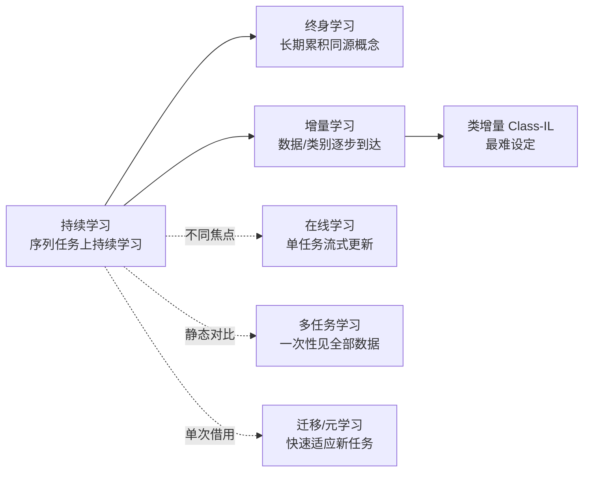
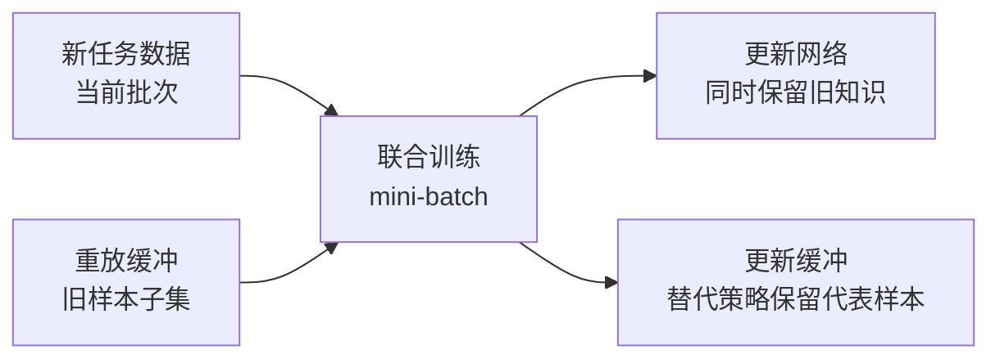

## 引言

现实世界的数据流永不停歇:今天部署的模型,明天就要面对新的任务、新的类别、新的数据分布。医学影像模型会遇到前所未见的病种,手术机器人的技能库需要不断扩充,推荐系统要吸收源源不断的新行为。然而,传统监督学习建立在两个隐蔽却苛刻的假设之上——训练数据独立同分布(i.i.d.),且任务集固定不变。一旦这两个假设在真实世界中破碎,模型就会陷入一个尴尬的境地:**学习新知识的同时,迅速遗忘旧知识**。

这正是持续学习(Continual Learning,又称 Lifelong Learning)要解决的挑战。它研究如何让模型在连续到达的任务与数据上不断学习,同时保持对旧任务的性能——既拥有「可塑性」(plasticity)以吸收新知识,又保有「稳定性」(stability)以不遗忘旧知识。本文试图为这个领域绘制一张地图:先剖析灾难性遗忘的本质,再延伸梳理持续学习在机器学习概念谱系中的位置与三种增量设定,随后深入三类主流方法(正则化、经验回放、参数隔离),最后讨论评估基准、方法权衡,以及与我们最相关的医学影像与机器人场景。

## 核心问题:灾难性遗忘

如果持续学习是处方,那灾难性遗忘就是它要治的病。理解这味「病」的机理,是理解所有方法的前提。

**直观解释**。深度神经网络的参数是跨任务共享的。当模型学习任务 B 时,梯度下降会调整那些「碰巧对任务 B 也有用」的权重——而这些权重可能正是任务 A 性能的关键。训练任务 B 带来的权重更新覆盖了任务 A 学到的知识,导致任务 A 的性能急剧下滑:


**正式定义**。灾难性遗忘(Catastrophic Forgetting / Catastrophic Interference)指:模型在连续学习新任务后,对先前任务的表现出现显著且突然的下降,即使旧任务的数据不再被访问<cite>[1]</cite>。这个概念最早由 McCloskey 和 Cohen 在 1989 年对连接主义网络的经典研究中提出——他们发现简单的前馈网络在顺序学习两组模式时会「灾难性地」干扰先前学到的模式<cite>[1]</cite>。French 随后在 1999 年的综述中系统分析了这一现象的理论根源,指出**权重共享与局部表示**是遗忘的主要诱因<cite>[2]</cite>。

值得注意的是,多任务学习(Multi-Task Learning)之所以不遭受遗忘,是因为它一次性见到全部任务的数据并联合训练——这绕开了「顺序学习」这个前提,而不是真正解决了遗忘问题(这一点我们将在下一节展开)。

**历史脉络**。灾难性遗忘的研究大致分三段:奠基期(1989–1999),McCloskey & Cohen 与 French 奠定了现象与机制的分析框架<cite>[1]</cite><cite>[2]</cite>;随后是连接主义研究退潮的沉寂期;以及 2017 年以来的深度学习复兴——Kirkpatrick 等人提出弹性权重巩固(EWC),第一次在大规模深度网络上展示了有效的缓解方法<cite>[10]</cite>,由此开启了一个高度活跃的研究时代。

这段脉络引出了持续学习中最基本的张力——**稳定性-可塑性困境**(stability-plasticity dilemma):网络越「稳定」(保留旧任务),就越难「可塑」(快速学新任务);反之亦然。我们接下来看到的三类方法,本质上都是对这一矛盾的不同取舍。

## 概念谱系:持续学习在机器学习地图中的位置

持续学习并不是孤立概念。它与终身学习、增量学习、在线学习、多任务学习、迁移学习、元学习等术语在文献中常常混用,却各有侧重。本节先把这些概念的定义与边界厘清,再深入持续学习内部的三种增量设定。

### 六个相邻概念

| 概念 | 定义 | 与持续学习的区别 |
|---|---|---|
| **持续学习** (Continual Learning) | 在连续到达的任务序列上顺序学习,同时追求新任务性能提升与旧任务性能保持 | 核心概念;同时要求可塑性与稳定性 |
| **终身学习** (Lifelong Learning) | 模型在整个生命周期内不断学习、积累并利用过往经验 | 与持续学习同源,更强调跨越漫长生命周期的知识累积<cite>[4]</cite> |
| **增量学习** (Incremental Learning) | 训练数据或类别逐步到达,模型增量更新而非从头训练 | 持续学习的子集,聚焦「增量」本身,按数据/类别/域细分<cite>[7]</cite> |
| **在线学习** (Online Learning) | 样本逐个到达、模型实时更新 | 关注单任务的流式效率,不涉及跨任务的旧知识保持 |
| **多任务学习** (MTL) | 同时联合训练多个任务、共享底层表示 | 一次性见到全部数据,无顺序学习、因此无遗忘问题 |
| **迁移学习 / 元学习** | 迁移:复用源任务知识到目标任务;元学习:学会「如何学习」以快速适应 | 都是**单次**借用(一次迁移/一次适应),而持续学习是**长期反复**的知识累积<cite>[5]</cite> |

这六个概念的关系可以这样理解:持续学习是圆心,终身学习是它在时间维度上的拉长;增量学习是它在数据到达方式上的特化;在线学习、多任务学习、迁移/元学习则分别在「更新效率」「数据可见性」「借用次数」上与它分道扬镳。

### 三种增量设定

「增量学习」内部还因数据到来的方式不同,衍生出三种难度递增的设定——这是持续学习文献中最容易混淆、也最重要的分类:

- **Task-IL(任务增量)**:每个任务带有已知的任务 ID,模型为每任务配备独立输出头,测试时任务 ID 已知、只需选择对应头。难度最低。
- **Class-IL(类增量)**:新类别不断加入,所有类别共享一个分类器,测试时不知道样本来自哪个任务。模型必须从不断累积的类别池中正确判别——这是目前研究最活跃、也最难的设定,因为「全类别判别」对旧类别提出了苛刻的区分要求<cite>[7]</cite><cite>[8]</cite>。
- **Domain-IL(域增量)**:输入分布变化(如成像域变化)而标签集相同,模型需适应新域而不忘记旧域。

一个直觉:**Task-IL 因为知道「现在该用哪个头」,天然回避了跨任务竞争;Class-IL 则把遗忘的后果直接暴露在分类决策上**,所以成为检验方法真实水平的试金石<cite>[8]</cite>。



## 三类主流方法

理解了遗忘的机制与概念边界,接下来进入核心:如何缓解遗忘?主流方法可以划分为三大范式,它们分别从「约束旧参数」「重见旧数据」「隔离新参数」三个角度回应稳定性-可塑性困境。

### 正则化方法:约束旧参数

正则化方法的思路最直接:**哪些参数对旧任务重要,新任务就不要轻易动它们**。它不需要存储旧数据,只需在损失函数中附加一个「参数重要性惩罚」。

**EWC(Elastic Weight Consolidation)**<cite>[10]</cite>。Kirkpatrick 等人 2017 年提出,这是持续学习复兴的标志性工作。其关键洞察是:不同参数对旧任务的重要性不同,惩罚也应不同。重要性由 **Fisher 信息矩阵**(Fisher Information Matrix)度量——它衡量参数对数据对数似然的一阶敏感度,Fisher 值大的参数,扰动它就会明显损害旧任务。

EWC 的总损失是:

$$
L(\theta) = L_B(\theta) + \sum_i \frac{\lambda}{2} F_i (\theta_i - \theta^*_i)^2
$$

其中 $L_B$ 是新任务的损失,$\theta^*$ 是学完旧任务后的参数,$F_i$ 是旧任务在第 $i$ 个参数上的 Fisher 信息,$\lambda$ 权衡新旧任务。直观上,这是把参数「锚定」在旧任务最优值附近,Fisher 越大锚得越紧。PyTorch 中的概念实现如下:

```python
# EWC 的 Fisher 估计:用梯度平方近似参数重要性
def estimate_fisher(model, dataloader):
    fisher = {n: torch.zeros_like(p) for n, p in model.named_parameters()}
    model.eval()
    for x, y in dataloader:
        model.zero_grad()
        out = model(x)
        loss = F.nll_loss(F.log_softmax(out, dim=1), y)
        loss.backward()
        for n, p in model.named_parameters():
            if p.grad is not None:
                fisher[n] += p.grad.detach() ** 2  # 梯度平方近似 Fisher
    return fisher

# EWC 二次惩罚:约束参数不偏离旧任务最优值
def ewc_penalty(model, fisher, old_params, lam=1.0):
    loss = 0.0
    for n, p in model.named_parameters():
        loss += (fisher[n] * (p - old_params[n]).pow(2)).sum()
    return lam / 2.0 * loss
```

**SI(Synaptic Intelligence)**<cite>[11]</cite>。Zenke 等人同年提出,通过在线累积「每个参数在先前任务中贡献了多少损失变化」来估计重要性(路径积分),避免存储全部旧任务数据来计算 Fisher,更适合在线设定。

**LwF(Learning Without Forgetting)**<cite>[12]</cite>。Li 与 Hoiem 的思路不同:用旧模型对新数据生成软标签(知识蒸馏),让新训练同时「对齐旧模型在新样本上的输出」,从而在不重放旧数据的情况下保留旧任务的决策边界。

**MAS(Memory Aware Synapses)**<cite>[13]</cite>。Aljundi 等人提出无监督的重要性估计:用模型对输入的输出变化来度量参数重要性,无需任何标签,在无监督或标签稀疏场景下更实用。

正则化方法的**优势**是内存开销极低(只存 Fisher 或重要性向量)且无需旧数据;**局限**是旧任务约束会限制新任务的容量,任务数一多,「约束墙」越来越紧,遗忘仍然缓慢累积。

### 经验回放方法:重见旧数据

经验回放(Replay / Memory)是最符合直觉、也往往最有效的一类方法:**存一些旧样本(或生成旧样本),和新数据一起训练**,让模型「不要忘记旧数据长什么样」。

**iCaRL(Incremental Classifier and Representation Learning)**<cite>[14]</cite>。Rebuffi 等人 2017 年提出,是类增量学习(Class-IL)的经典:维护一个小型样本缓冲,训练时联合回放;同时用知识蒸馏保持旧类别的输出分布;分类时用**最近类均值**(NCM)而非全连接分类头,从而避免新类别更新扰动旧类别。它的三个组件——回放、蒸馏、NCM——成为后续大量工作的模板。

**GEM(Gradient Episodic Memory)**<cite>[15]</cite>。Lopez-Paz 与 Ranzato 提出一种「约束」式回放:不直接混合样本训练,而是保证**新任务的梯度不会增加任何旧任务的损失**——通过投影把梯度限制在旧任务损失下降的可行域内。这从优化角度保证了旧任务不退化,但投影涉及所有旧任务的存储梯度。

**A-GEM 与 ER(Efficient Replay)**<cite>[16]</cite>。Chaudhry 等人指出 GEM 的计算与存储开销较高,提出近似版本:A-GEM 只保证「梯度不平均地增加旧任务损失」,经验回放(ER)则回归最朴素的形式——把缓冲样本混进每个 mini-batch。两者在效果与效率之间取了更实用的平衡点,ER 也因此成为后续方法强力的基线。

**GDumb:一个发人深省的上界**<cite>[17]</cite>。Prabhu 等人 2020 年给出一个「简单得令人不安」的基准:每当新任务到来,只用缓冲中的全部样本**从头训练一个全新模型**,不做任何复杂设计,就能在多数 Class-IL 基准上击败当时的大多数方法。它的意义在于**质疑了复杂方法的真实增益**——如果「存储 + 重训」就能接近最优,那么许多精心设计的遗忘缓解机制是否真的有效?

回放方法的典型流程:



回放方法的**优势**是效果好、通用性强;**局限**同样明显:需要内存存储样本,且在某些场景(如医疗数据)受**隐私限制**无法保留原始样本,于是催生了生成式回放(用生成模型重建旧样本)等变体<cite>[23]</cite>。

### 参数隔离方法:新任务新参数

参数隔离(Parameter Isolation / Architecture)方法最为「奢侈」:**给每个新任务分配独立或专用的参数**,从结构上杜绝跨任务干扰。

**Progressive Neural Networks**<cite>[19]</cite>。Rusu 等人 2016 年提出:为每个新任务新建一个子网络,并通过横向连接借用旧任务的隐表示,同时**冻结旧网络**。它的遗忘为零,但网络随任务数线性膨胀,推理时需运行所有子网络,开销巨大。

**PackNet**<cite>[20]</cite>。Mallya 与 Lazebnik 提出一种更节俭的做法:训练完一个任务后,按重要性**剪枝**掉一部分参数,下一个任务在剪出的「空洞」里重新训练。这样网络总容量固定、参数不膨胀,但需要为每个任务保留一个「掩码」,且任务数超过容量后会饱和。

**DEEPN(Dynamically Expandable Networks)**<cite>[21]</cite>。Yoon 等人引入「神经元复用 + 按需扩展」:当新任务可以复用旧神经元时复用,无法复用时才动态新增神经元,从而在容量与遗忘之间自适应。

参数隔离方法**最彻底地消除了遗忘**(新旧任务参数互不干扰),但代价是参数量与计算量随任务线性增长——这在参数规模动辄数十亿的今天显得尤为昂贵,但在对安全性要求极高的医疗场景(不允许任何旧知识退化)中仍具吸引力。

## 评估基准与协议

方法好不好,取决于怎么测。持续学习的评估长期缺乏统一标准,本节厘清常用基准、协议与指标。

### 常用基准

- **Split MNIST / Split CIFAR-100**:把标准数据集按类别切成多个顺序任务(如 CIFAR-100 切成 10 个 10 类任务),是最常用的验证场<cite>[6]</cite>。
- **Mini-ImageNet / ImageNet-100**:更大规模,考验方法在真实图像上的扩展性。
- **CORe50**:面向域增量的连续对象识别基准,包含不同光照与角度下的 50 个对象类别,更贴近现实<cite>[6]</cite>。
- **DomainNet / Rotated MNIST**:域增量设定下常用的域漂移基准。

### 评估协议:三种设定

评估协议必须与任务到达方式绑定,这正是第三节三种增量设定的用武之地:

- **Task-IL**:每个任务独立报告准确率(任务 ID 已知)。
- **Class-IL**:在所有已见类别的联合分类器上报告「全类别准确率」——这是最严苛的协议<cite>[7]</cite><cite>[8]</cite>。
- **Domain-IL**:按域报告泛化能力。

### 指标定义

**平均准确率(ACC)**。学完 T 个任务后,各任务最终准确率的平均。它回答「模型现在整体有多好」。

**后向迁移(Backward Transfer, BWT)**。衡量「学到新任务后,旧任务退化了多少」——这是遗忘的直接度量:

$$
BWT = \frac{1}{T-1} \sum_{i=1}^{T-1} \left( a_{T,i} - a_{i,i} \right)
$$

其中 $a_{j,i}$ 是学完任务 $j$ 后、任务 $i$ 的准确率。BWT 越接近 0 说明遗忘越少,为负则意味着遗忘<cite>[9]</cite>。

**前向迁移(Forward Transfer, FWT)**。衡量新任务借用了多少旧任务知识(相对随机初始化),正值表示正向迁移。

**陷阱**。最大的陷阱是**协议不一致导致结果不可比**:同一方法在 Task-IL 下表现优异、在 Class-IL 下可能一塌糊涂。Masana 等人的综述专门复盘了这一现象,呼吁统一在 Class-IL 上报告并明确协议细节<cite>[8]</cite>。

## 方法对比与权衡

| 方法 | 范式 | 内存开销 | 是否需旧数据 | 防遗忘强度 | 代表工作 |
|---|---|---|---|---|---|
| EWC | 正则化 | 低(仅 Fisher) | 否 | 部分 | [10] |
| LwF | 正则化+蒸馏 | 低 | 否 | 部分 | [12] |
| iCaRL | 回放+蒸馏 | 中(样本) | 是 | 较强 | [14] |
| GEM | 回放(梯度约束) | 中 | 是 | 较强 | [15] |
| GDumb | 回放 | 高(全样本) | 是 | 强(上界) | [17] |
| Progressive Net | 参数隔离 | 高(参数) | 否 | 强 | [19] |

三类范式本质上分别以「**约束旧参数 / 重见旧数据 / 隔离新参数**」三种方式解同一道稳定性-可塑性难题:正则化最省内存但后劲不足;回放效果最好却受隐私与内存掣肘;参数隔离最彻底但容量代价最高。没有免费的午餐——**选型必须回到场景约束**。

## 医疗/机器人应用

对医学影像与手术机器人而言,持续学习不是学术消遣,而是**刚需**——医疗场景恰好是「数据永不停止」的极端样本。更重要的是,这个领域已经有实实在在的研究积累,而不只是概念上的「应该需要」。

### 医学影像的三大动机

- **新病种/新征象不断出现**。一次疫情就带来新的影像征象;新的突变、新的并发症要求模型快速学会识别,而不能因重训旧任务而丢失既有病种的知识。
- **跨中心域漂移**。不同厂商的扫描设备、不同协议、不同患者群体构成持续的分布偏移,模型需要不断适应新域(域增量),同时保持对旧域的稳健。事实上,医学影像中最常见的持续学习设定正是**增量域场景**——语义不变、成像特征在变<cite>[27]</cite>。
- **标注数据在各中心「各自为政」**。数据往往因隐私无法集中,各中心增量产生新标注——持续学习天然契合这种「边到边学」的联邦式积累。

### 具体研究进展

近几年的医学影像持续分割研究,已经形成了几条清晰的技术路线:

- **数据无关的合成回放**。由于医疗数据无法存储原始样本,研究者转向**合成伪图像**回放。MOSInversion 用 DeepInversion 从预训练模型合成多样的腹部 CT 伪图像(以分割掩码为像素级引导),在不接触真实病人数据的前提下做知识蒸馏,在 FLARE21、MSD、KiTS19 三个公开腹部数据集上达到领先——相比存储真实样本的回放方法,它彻底绕开了 3D 数据的存储与隐私问题<cite>[30]</cite>。
- **跨站点的风格回放**。FR²Seg 面向「跨中心、跨设备」的持续分割:提取并存储旧站点的低频傅里叶振幅(代表域风格),在新站点训练时合成带旧站点风格的伪图像回放,同时用傅里叶自适应一致性正则约束域不变参数——既缓解遗忘、又不泄露旧站点的原始数据<cite>[28]</cite>。
- **参数隔离与高效微调**。Low-Rank Mixture-of-Experts 为医学分割引入数据特定的 MoE 结构,以低秩策略抑制新增参数的开销<cite>[29]</cite>;MedPEFT-CL 则基于 CLIPSeg 用双阶段 LoRA(仅 0.24–0.39M 可训练参数,对比 150M 全参)配合双向 Fisher 记忆协调,在医学视觉语言分割上把遗忘率从基线的 6.21% 压到 1.91%。
- **一个必要的反思**。Dounavi 等人尖锐地指出,大量医学持续学习研究只盯着「遗忘指标」,却忽视了可扩展性、隐私合规与**正向迁移**(旧域性能随时间不降反升)。他们提出 UNEG——维护多套任务专用模型、用自编码器重构误差自动选模型——作为临床更实用、也更该被当作下界的基准<cite>[27]</cite>。这与本文前面提到的 GDumb 精神一脉相承:**复杂方法先过简单基准这一关**。

此外,Lenga 等人在胸部 X 光分类上研究了持续学习用于**域适应**<cite>[22]</cite>;Perkonigg 等人提出**动态记忆**机制,在医学影像多任务序列上显著缓解灾难性遗忘<cite>[23]</cite>——它们奠定了这个子领域早期的探索基调。

### 医疗场景的特殊挑战

- **隐私与回放冲突**。经验回放类方法依赖存储旧样本,而医疗数据受严格监管——上述合成回放/风格回放正是为此而生的解法<cite>[28]</cite><cite>[30]</cite>。
- **标注昂贵**。新任务的标注往往稀缺,方法必须在小样本下仍有效。
- **临床安全**。误诊代价极高,模型更新必须**可追溯、可回滚**——这要求持续学习方法提供可验证的旧任务性能保证,而不仅是「平均不下降」。

### 手术机器人:技能积累与终身学习

手术机器人是持续学习「从图像到动作」的另一片前沿。UC San Diego ARCLab 的 **SurgIRL** 首次把增量强化学习引入手术自动化:机器人通过一个可扩展的知识集与注意力网络(KIAN-ACE),把已学会的十个手术任务技能**增量地复用与累积**,并在 da Vinci Research Kit(dVRK)上成功完成 sim-to-real 迁移<cite>[31]</cite>——这是「手术技能终身学习」早期但真实的样本。

而从人类外科医生的角度看,技能的**习得与遗忘**本身就是研究对象:一项对 18 名外科住院医长达六个月的纵向研究(972 次试验、同步视频与运动学数据)量化了手术技能学习中的会话内保留、换班间遗忘与离线学习,为「机器人/智能体应如何模拟人类技能积累」提供了数据基础<cite>[32]</cite>。

### 医疗大模型

当医学影像与 LLM/多模态大模型结合后,持续学习又遇到新问题:如何**持续预训练**新知识(新病种、新文献)而不破坏既有能力,如何做**知识编辑**修正过时信息。这引出了下一节的前沿问题。

## 前沿与开放问题

**理论理解仍然薄弱**。稳定性-可塑性困境至今缺乏统一的数学刻画;为什么某些方法在特定协议下有效、换一个协议就失效,仍多是经验性认识。

**与 LLM 的结合**是当前最活跃的方向:持续预训练(continual pre-training)、参数高效微调(PEFT)、知识编辑(knowledge editing)共同构成「让大模型永续更新」的拼图<cite>[26]</cite>。但 LLM 的海量参数让传统正则化/回放方法面临前所未有的规模压力。

**与更通用的智能体相联**。世界模型、具身智能体的经验是天然的「终身学习流」——这与本博客此前介绍的世界模型话题一脉相承:一个真正的通用智能体,必然是一个持续学习者。

**评估标准化**。大规模、多设定、统一的基准(如结合 Class-IL 与域漂移的真实医学基准)仍是社区的共同期待<cite>[8]</cite>。

## 总结

本文从持续学习要治的「病」——灾难性遗忘出发,完成了三件事:其一,厘清了持续学习与终身学习、增量学习、在线学习、多任务学习、迁移/元学习的**概念边界**,并引入 Task-IL / Class-IL / Domain-IL 三种设定;其二,系统梳理了三类主流方法——**正则化**(EWC/SI/LwF/MAS)约束旧参数、**经验回放**(iCaRL/GEM/A-GEM/GDumb)重见旧数据、**参数隔离**(Progressive Net/PackNet/DEEPN)隔离新参数,并给出各自的代价;其三,把视角落到医学影像与手术机器人,指出隐私、安全、持续更新等真实约束。

如果只能记住一个结论,那就是:**没有万能的持续学习算法,选型取决于你的约束**——内存紧张选正则化,可存样本且效果优先选回放,容错率极低(如临床)选参数隔离。而无论选哪种,都请先在 Class-IL 协议下验证,再谈部署。

## 参考文献

1. *Catastrophic Interference in Connectionist Networks.* McCloskey M, Cohen N J. The Psychology of Learning and Motivation, 1989.  
   <https://doi.org/10.1016/S0079-7421(08)60536-8>
2. *Catastrophic Forgetting in Connectionist Networks.* French R M. Trends in Cognitive Sciences, 3(4), 1999.  
   <https://doi.org/10.1016/S1364-6613(99)01294-2>
3. *Continual Learning in Reinforcement Environments.* Ring M B. PhD Thesis, University of Texas at Austin, 1994.  
   <https://www.cs.utexas.edu/~ring/Ring-phd.pdf>
4. *Is Learning the n-th Thing Any Easier Than Learning the First?* Thrun S. NIPS, 1996.  
   <https://papers.nips.cc/paper/1996/files/716e1b8c6cd17b771da77391355749f3-Paper.pdf>
5. *Continual Lifelong Learning with Neural Networks: A Review.* Parisi G I, Kemker R, Part J L, Kanan C, Wermter S. Neural Networks, 113, 2019.  
   <https://doi.org/10.1016/j.neunet.2019.01.012>
6. *A Continual Learning Survey: Defying Forgetting in Classification Tasks.* De Lange M, Aljundi R, Masana M, Parisot S, Jia X, Leonardis A, Slabaugh G, Tuytelaars T. IEEE TPAMI, 43(12), 2021.  
   <https://arxiv.org/abs/1909.08383>
7. *Three Scenarios for Continual Learning.* van de Ven G M, Tolias A S. arXiv:1904.07734, 2019.  
   <https://arxiv.org/abs/1904.07734>
8. *Class-Incremental Learning: Survey and Performance Evaluation.* Masana M, Liu X, Twardowski B, Menta M, Bagdanov A D, van de Weijer J. IEEE TPAMI, 45(5), 2022.  
   <https://arxiv.org/abs/2010.15277>
9. *Measuring Catastrophic Forgetting in Neural Networks.* Kemker R, McClure M, Abitino A, Hayes T L, Kanan C. AAAI, 2018.  
   <https://arxiv.org/abs/1708.02072>
10. *Overcoming Catastrophic Forgetting in Neural Networks.* Kirkpatrick J, Pascanu R, Rabinowitz N, et al. PNAS, 114(13), 2017.  
    <https://doi.org/10.1073/pnas.1611835114>
11. *Continual Learning Through Synaptic Intelligence.* Zenke F, Poole B, Ganguli S. ICML, 2017.  
    <https://arxiv.org/abs/1703.04200>
12. *Learning Without Forgetting.* Li Z, Hoiem D. ECCV, 2017.  
    <https://arxiv.org/abs/1606.09282>
13. *Memory Aware Synapses: Learning What (Not) to Forget.* Aljundi R, Babiloni F, Elhoseiny M, Rohrbach M, Tuytelaars T. ECCV, 2018.  
    <https://arxiv.org/abs/1711.09601>
14. *iCaRL: Incremental Classifier and Representation Learning.* Rebuffi S A, Kolesnikov A, Sperl G, Lampert C H. CVPR, 2017.  
    <https://arxiv.org/abs/1611.07725>
15. *Gradient Episodic Memory for Continual Learning.* Lopez-Paz D, Ranzato M A. NIPS, 2017.  
    <https://arxiv.org/abs/1706.08840>
16. *Efficient Lifelong Learning with A-GEM.* Chaudhry A, Ranzato M, Rohrbach M, Elhoseiny M. ICLR, 2019.  
    <https://arxiv.org/abs/1812.00420>
17. *GDumb: A Simple Approach that Questions Our Progress in Continual Learning.* Prabhu A, Torr P H S, Dokania P K. ECCV, 2020.  
    <https://arxiv.org/abs/1910.07113>
18. *Large-Scale Incremental Learning.* Wu Y, Chen Y, Wang L, Ye Y, Liu Z, Guo Y, Fu Y. CVPR, 2019.  
    <https://arxiv.org/abs/1905.13262>
19. *Progressive Neural Networks.* Rusu A A, Rabinowitz N C, Desjardins G, Soyer H, Kirkpatrick J, Kavukcuoglu K, Pascanu R, Hadsell R. arXiv:1606.04671, 2016.  
    <https://arxiv.org/abs/1606.04671>
20. *PackNet: Adding Multiple Tasks to a Single Network by Iterative Pruning.* Mallya A, Lazebnik S. CVPR, 2018.  
    <https://arxiv.org/abs/1711.05769>
21. *Lifelong Learning with Dynamically Expandable Networks.* Yoon J, Yang E, Lee J, Hwang S J. ICLR, 2018.  
    <https://arxiv.org/abs/1708.01547>
22. *Continual Learning for Domain Adaptation in Chest X-ray Classification.* Lenga M, Schulz H, Saalbach A. arXiv:2011.12205, 2020.  
    <https://arxiv.org/abs/2011.12205>
23. *Dynamic Memory to Alleviate Catastrophic Forgetting in Continual Learning with Medical Imaging.* Perkonigg M, Hofmanninger J, Herold C J, et al. arXiv:2104.09013, 2021.  
    <https://arxiv.org/abs/2104.09013>
24. *Progress & Compress: A Scalable Framework for Continual Learning.* Schwarz J, Czarnecki W, Luketina J, et al. ICML, 2018.  
    <https://arxiv.org/abs/1805.06370>
25. *Incremental Learning of Object Detectors Without Catastrophic Forgetting.* Shmelkov K, Schmid C, Alahari K. ICCV, 2017.  
    <https://arxiv.org/abs/1708.06977>
26. *Continual Learning of Language Models.* Ke Z, Liu B, et al. ICLR, 2023.  
    <https://arxiv.org/abs/2302.03241>
27. *What is Wrong with Continual Learning in Medical Image Segmentation? Moving Beyond Catastrophic Forgetting and Towards Practical Knowledge Accumulation.* Dounavi L, Kordon F, Feussner H, et al. arXiv:2010.11008, 2020.  
    <https://arxiv.org/abs/2010.11008>
28. *FR²Seg: Continual Segmentation Across Multiple Sites via Fourier Style Replay and Adaptive Consistency Regularization.* AAAI, 2025.  
    <https://ojs.aaai.org/index.php/AAAI/article/view/32953>
29. *Low-Rank Mixture-of-Experts for Continual Medical Image Segmentation.* MICCAI, 2024.  
    <https://dtic.dimensions.ai/details/publication/pub.1176312267>
30. *MOSInversion: Knowledge Distillation-based Incremental Learning in Organ Segmentation using DeepInversion.* Computers in Biology and Medicine, 2025.  
    <https://www.sciencedirect.com/science/article/abs/pii/S0010482525016269>
31. *SurgIRL: Towards Life-Long Learning for Surgical Automation by Incremental Reinforcement Learning.* Ho Y, Chiu Z, Zhi Y, Yip M C. IEEE Robotics and Automation Letters, 10(12), 2025.  
    <https://arxiv.org/abs/2409.15651>
32. *Dataset and Analysis of Long-Term Skill Acquisition in Robot-Assisted Minimally Invasive Surgery.* arXiv:2503.21591, 2025.  
    <https://arxiv.org/abs/2503.21591>
{: .references }
