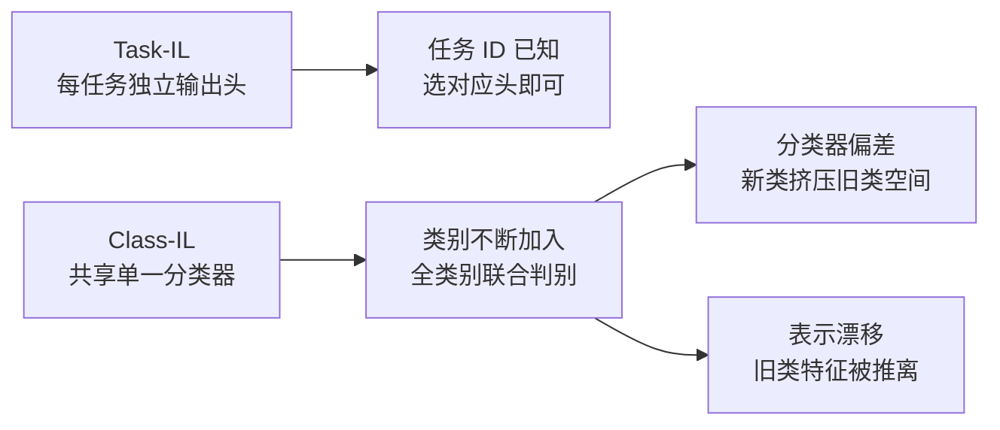

## 引言

在我们此前的持续学习全景中,我们把增量学习分为任务增量(Task-IL)、类增量(Class-IL)与域增量(Domain-IL)三种设定,并指出 **Class-IL 是最难、也最能检验方法真实水平的一种**。这篇专题文章把它单独拎出来:为什么它难?研究又是如何一步步逼近它的?

先给出一个贯穿全文的直觉:Task-IL 知道「现在该用哪个任务头」,Class-IL 不知道——它必须在一个不断扩大的类别池里做**全类别判别**。仅仅是这一点差异,就足以让绝大多数方法在 Task-IL 上风光无限、在 Class-IL 上原形毕露<cite>[4]</cite>。接下来我们从「为什么难」讲起,再沿着方法演进的五波浪潮,看研究者如何逐步逼近这个难题,最后讨论评估中的陷阱。

## 为什么 Class-IL 最难

作为持续学习的核心设定,Class-IL 的根基同样是灾难性遗忘——这个自 1989 年就被系统研究的现象<cite>[1]</cite><cite>[2]</cite>。但在 Class-IL 中,它的症状被叠加放大。Class-IL 的难点不是单一的,而是**三个问题叠加**:

### 旧类判别:遗忘被直接暴露在决策上

Task-IL 每个任务有自己的输出头,测试时选择正确头即可——旧任务的判别错误被「结构性隔离」了。Class-IL 则共享一个分类器,新类别加入时,分类器的权重更新会**挤压旧类别的决策空间**。遗忘不再是一个抽象的平均指标,而是具体的「把旧类样本分到新类」的错误。这正是 Class-IL 与 Task-IL 的核心分水岭<cite>[3]</cite><cite>[4]</cite>:

### 表示漂移:旧类特征的「家园」在移动

当模型在新类别上训练时,不仅分类器在变,**特征提取器的表示空间也在整体漂移**。旧类别样本在新表示下的位置偏离了它们原本聚集的地方——即使模型「还记得」旧类,旧类特征在变化后的空间里也已面目全非。这一现象被称为**表示漂移**(representation drift),是 Class-IL 中比参数覆盖更难察觉、也更根本的遗忘来源<cite>[7]</cite>。

### 分类器偏差:新类天然占优

由于新类样本「当下可见」而旧类样本「只在记忆中」,训练自然偏向新类——分类器对新类的 logits 系统性偏大。这就是**分类器偏差**(classifier bias toward new classes)<cite>[6]</cite>。它解释了为什么即使表示没怎么坏,Class-IL 的准确率也会随任务数急剧下滑:最后一层在「记忆犹新」的新类面前,把旧类样本误分过去了。

一个推论:解决 Class-IL,至少要同时面对**表示漂移**(表示层面)与**分类器偏差**(决策层面)——早期方法往往只治其一,这就是后续演进的核心驱动力。

## 第一波:重放 + 蒸馏的奠基(2017–2019)

### iCaRL:三件套范式

**iCaRL**(Incremental Classifier and Representation Learning)是 Class-IL 的奠基之作,它把三个组件组合成了一个至今仍被广泛借鉴的模板<cite>[5]</cite>:

- **样本回放**:维护一个小型样本缓冲,训练时联合重放旧样本;
- **知识蒸馏**:让新模型在新数据上「对齐旧模型的输出」,以保留旧类别的决策;
- **最近均值分类器(NCM)**:放弃学得的全连接头,改用「每类特征均值 + 最近邻」做分类,规避新类别更新对旧类别权重的直接冲击。

iCaRL 的意义在于**确立了一个重要认知:光靠蒸馏不够,回放是刚需**。它的蒸馏部分在保护表示,回放部分在修正表示漂移,NCM 在缓解分类器偏差——三件套各自对着一个病根。

### BiC:第一次直面分类器偏差

iCaRL 用 NCM 绕开了偏差,但代价是放弃了可学习的分类器。**BiC(Bias Correction)** 换了一个思路:保留全连接头,但在任务切换后用一个小的「偏差校正层」对 logits 做线性校正,显式地把新类偏置掰回来<cite>[6]</cite>。它是「偏差校正」这一支的起点,后续 WA(权值对齐)等方法是它的进化版<cite>[9]</cite>。

## 第二波:表示层面的对抗(2019–2020)

第一波方法发现:即使有回放和蒸馏,旧类在新表示下的「位置」仍在漂移。第二波开始直接向表示漂移开刀。

### LUCIR:余弦归一化 + 大间隔

**LUCIR**(Learning a Unified Classifier Incrementally via Rebalancing)观察到,在 Class-IL 中,新类由于「出场晚」,其分类权重向量的范数天然偏大,挤压旧类。它的两个核心对策<cite>[7]</cite>:

- **余弦归一化**:把分类器从「内积」改为「余弦相似度」,消除权重范数差异带来的偏差;
- **margin 约束**:训练时强制样本与真实类的余弦相似度大于与其他类的 margin,防止旧类特征被新类「拽走」。

LUCIR 把问题从「决策层偏差」推进到「表示与度量层」,是 Class-IL 一个重要的视角跃迁。

### PODNet:特征空间的分段蒸馏

**PODNet**(Pooled Outputs Distillation)更进一步,提出「池化输出蒸馏」(POD)——把旧模型在中间层特征上的**空间池化统计量**作为蒸馏目标,而不是只蒸馏最后一层的 logits<cite>[8]</cite>。这样做的好处是:它约束的是**整个特征空间**的逐位置分布,能更精细地防止表示漂移,尤其适合「小任务」序列(每批只来很少类别)的设定。

## 第三波:回放的强化与反思(2020–2022)

### DER:回放「经验」而非「样本」

**DER(Dark Experience Replay)** 提出一个微妙的改进:与其重放旧样本的原始输入,不如重放旧模型在旧样本上的**logits(暗经验)**<cite>[10]</cite>。训练新任务时,让新模型在旧样本上尽量复现旧模型的输出分布——这相当于把「旧模型的软知识」当作重放对象,与 iCaRL 的「回放 + 蒸馏」相比更统一、更灵活,在通用持续学习基准上表现突出。

### 反思:GDumb 的当头棒喝

我们在全景文中已经介绍过 **GDumb**<cite>[11]</cite>:只存样本、每次从头训练,就能击败大多数复杂方法。这个「简单上界」在 Class-IL 领域尤其刺眼——因为 Class-IL 的难点集中在「在线表示更新」上,而 GDumb 干脆不做在线更新。它提示我们:**任何声称解决 Class-IL 的复杂方法,都必须先回答「比起存样本重训,你多做了什么」**。这一反思在预训练时代有了新的回响(见第四波)。

## 第四波:预训练时代的范式转换(2022– )

2022 年前后,大规模预训练模型(如 CLIP、ImageNet 预训练 ResNet)进入持续学习领域,带来了一个**近乎质变**的转变:既然预训练特征已经足够强、足够通用,为什么还要在增量过程中继续更新骨干网络?

### 冻结骨干 + 原型:最朴素的解法反成最强基线

**Linear Probe / SimpleCIL 范式**的回答是:冻结预训练骨干,只学最后一层(或直接用类原型),增量时**骨干完全不动**——表示漂移问题「被绕开而非解决」。这一类方法如 **FeCAM**(用协方差建模类分布做最近类均值分类)<cite>[16]</cite>,以及 **RanPAC**(在冻结特征后接一个固定随机投影层增强线性可分性)<cite>[14]</cite>,在 Split-ImageNet 等基准上把准确率拉到了此前难以想象的高度。这本质上是 GDumb 精神的预训练版本:**强特征 + 简单分类,胜过复杂算法**。

### 提示学习:让骨干「冻结但适配」

**L2P(Learning to Prompt)** 和 **DualPrompt** 给出另一条路:不微调骨干,而是**学习一组可微的提示(prompt)向量**插入 Transformer 骨干,用提示来「按任务切换」骨干的响应<cite>[12]</cite><cite>[13]</cite>。提示本身是可增量学习的参数,而骨干保持冻结——既保留了预训练特征,又获得了跨任务的适配能力,且天然具有「参数隔离」的防遗忘属性。

### SLCA:在预训练特征上重新思考「慢学」

**SLCA(Slow Learner with Classifier Alignment)** 提出另一个洞察:预训练特征下,表示几乎不漂移,真正的瓶颈回到**分类器偏差**;因此它用「慢学习率学习表示 + 显式对齐分类器」的组合,在预训练设定下刷新了多个基准<cite>[15]</cite>。它印证了一个趋势:**预训练时代,Class-IL 的难点从「表示漂移」重新聚焦回「分类器偏差」**——难点并没有消失,只是换了位置。

这一波方法的系统性梳理,可参见 Zhou 等人的两份综述:Class-Incremental Learning 全景<cite>[17]</cite> 与预训练模型持续学习专题<cite>[18]</cite>。

## 评估陷阱与公平比较

方法演进越热闹,评估越需要警惕——因为 Class-IL 的结论高度依赖「怎么测」。

**第一个陷阱:协议错配**。Task-IL 与 Class-IL 的准确率差距极大,把 Task-IL 的成绩当作 Class-IL 的声明,会系统性高估方法。统一在 Class-IL 协议下报告,是领域的基本共识<cite>[3]</cite><cite>[4]</cite>。

**第二个陷阱:内存不对齐**。Zhou 等人指出,许多方法在对比时没有对齐**存储预算**——回放方法的样本缓冲、蒸馏方法的额外模型、提示方法的提示参数,都被隐式地「免费」使用了<cite>[17]</cite>。公平比较必须把存储开销计入预算,否则复杂方法对简单基线的优势会大幅缩水。

**第三个陷阱:基准饱和**。预训练时代,冻结骨干方法在 Split-ImageNet 等基准上已经逼近饱和,单纯报告「更高 ACC」意义递减。更值得关注的是**跨设定的稳健性**(域漂移 + 类增量叠加)、**小任务/大序列**的可扩展性,以及与医疗等真实场景的差距——这正是我们下一节想强调的方向。

## 总结

类增量学习之所以是持续学习的「试金石」,是因为它把遗忘的全部症状——表示漂移、分类器偏差、旧类判别退化——**同时暴露在同一个分类决策上**。回顾五波演进:

| 波次 | 代表方法 | 核心思想 | 直面的问题 |
|---|---|---|---|
| 第一波(2017–19) | iCaRL、BiC | 回放 + 蒸馏 + NCM / 偏差校正 | 旧类判别、分类器偏差 |
| 第二波(2019–20) | LUCIR、PODNet | 余弦归一化、特征空间蒸馏 | 表示漂移 |
| 第三波(2020–22) | DER、GDumb | 暗经验回放 / 简单上界反思 | 回放效率、方法有效性 |
| 第四波(2022– ) | L2P、FeCAM、RanPAC、SLCA | 冻结骨干 + 原型/提示/生成特征 | 绕开表示漂移,聚焦分类器偏差 |

贯穿始终的一条主线是:**表示漂移与分类器偏差的博弈**——早期方法用回放和蒸馏「守住表示」,中期方法用归一化和特征蒸馏「矫正表示」,预训练时代则干脆「冻结表示」,把战场拉回决策层。而无论哪一波,GDumb 式的反思都提醒我们:**在投奔复杂算法之前,先问一句「简单上界怎么说」**。

如果你正在评估方法或设计实验,请记住三件事:在 Class-IL 协议下报告;对齐内存预算;以及——如果可能,先跑一遍「冻结骨干 + 原型」的基线。

## 参考文献

1. *Catastrophic Interference in Connectionist Networks.* McCloskey M, Cohen N J. The Psychology of Learning and Motivation, 1989.  
   <https://doi.org/10.1016/S0079-7421(08)60536-8>
2. *Overcoming Catastrophic Forgetting in Neural Networks.* Kirkpatrick J, et al. PNAS, 2017.  
   <https://doi.org/10.1073/pnas.1611835114>
3. *Three Scenarios for Continual Learning.* van de Ven G M, Tolias A S. arXiv:1904.07734, 2019.  
   <https://arxiv.org/abs/1904.07734>
4. *Class-Incremental Learning: Survey and Performance Evaluation.* Masana M, et al. IEEE TPAMI, 45(5), 2022.  
   <https://arxiv.org/abs/2010.15277>
5. *iCaRL: Incremental Classifier and Representation Learning.* Rebuffi S A, et al. CVPR, 2017.  
   <https://arxiv.org/abs/1611.07725>
6. *Large Scale Incremental Learning.* Wu Y, et al. CVPR, 2019.  
   <https://arxiv.org/abs/1905.13262>
7. *Learning a Unified Classifier Incrementally via Rebalancing.* Hou S, et al. CVPR, 2019.  
   <https://arxiv.org/abs/1903.02990>
8. *PODNet: Pooled Outputs Distillation for Small-Tasks Incremental Learning.* Douillard A, et al. ECCV, 2020.  
   <https://arxiv.org/abs/2004.13513>
9. *Maintaining Discrimination and Fairness in Class Incremental Learning.* Zhao B, et al. CVPR, 2020.  
   <https://arxiv.org/abs/1911.07053>
10. *Dark Experience for General Continual Learning.* Buzzega P, et al. NeurIPS, 2020.  
    <https://arxiv.org/abs/2004.07211>
11. *GDumb: A Simple Approach that Questions Our Progress in Continual Learning.* Prabhu A, et al. ECCV, 2020.  
    <https://arxiv.org/abs/1910.07113>
12. *Learning to Prompt for Continual Learning.* Wang Z, et al. CVPR, 2022.  
    <https://arxiv.org/abs/2112.08654>
13. *DualPrompt: Complementary Prompting for Rehearsal-free Continual Learning.* Wang Z, et al. ECCV, 2022.  
    <https://arxiv.org/abs/2204.04799>
14. *RanPAC: Random Projections and Pre-trained Models for Continual Learning.* McDonnell M D, et al. NeurIPS, 2023.  
    <https://arxiv.org/abs/2307.03051>
15. *SLCA: Slow Learner with Classifier Alignment for Continual Learning on a Pre-trained Model.* Zhang G, et al. ICCV, 2023.  
    <https://arxiv.org/abs/2303.05118>
16. *FeCAM: Exploiting the Heterogeneity of Class Distributions in Exemplar-Free Continual Learning.* Zhang Y, et al. NeurIPS, 2023.  
    <https://arxiv.org/abs/2309.14062>
17. *Class-Incremental Learning: A Survey.* Zhou D-W, et al. IEEE TPAMI, 2024.  
    <https://arxiv.org/abs/2302.03653>
18. *Continual Learning with Pre-Trained Models: A Survey.* Zhou D-W, et al. IJCAI Survey Track, 2024.  
    <https://arxiv.org/abs/2401.16386>

{: .references }
